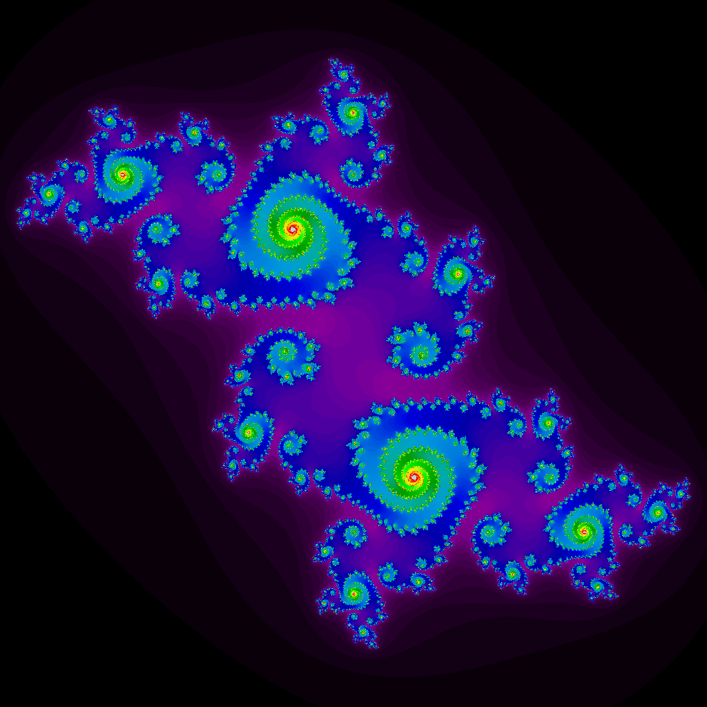

# Julia-sets-Mandelbrot-set
intro to fractals, summarizing Julia sets and explaining the difference between them and the Mandelbrot set.

it's all in only one Jupyter Notebook file with explanations and code

